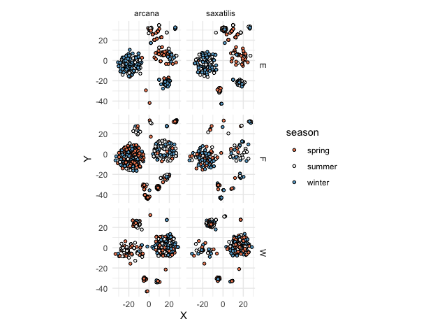

```{r setup, include=FALSE}
knitr::opts_chunk$set(echo = TRUE)
```


```{r , echo = FALSE , fig.cap = "tSNE Embeddings of community data seperated by survey location. Colours indicate season of collection for \\textit{saxatalis} and \\textit{arcarna} individuals"}


```
\pagebreak

```{r , echo = FALSE , fig.cap = ""}
tab <- readRDS("../data/multinomTab.rds") 
knitr::kable(tab$coefficients,caption = "Multivariate regression model output. Terms with P<0.05 had significant effects on community composition.")
```

---
```{r , echo = FALSE,out.width = "500px" , fig.cap = "Effects of aspect , community composition and height on probability of observing \\textit{saxatalis} or \\textit{arcana}.Values approaching 1 indicate increasing pribability of observing \\textit{saxatalis}, vice versa for 0 and \\textit{arcana}."}

```


